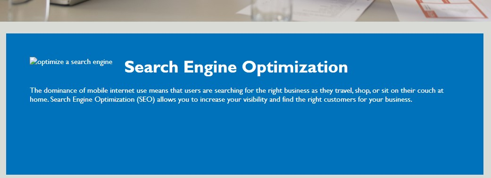

# Frontend Portfolio project

## Description
This project modifies the html structure to make it more accessible.
This is done by including semantic elements throughout the pages so that it can be more accessible to search engines. It also adds alternative texts to image tags to make them informative even when the images do not render and also make it accessible to divices like braille keyboards. The link to the deployed page can be found [here]()

## Usage
If all is well, then there is no difference between an inaccessible page and an accessible one visually, the difference becomes subtle when a link breaks or one site shows up in searches more than yours. Below is the difference between a page when all is well and an accessible page when things break.
The original page

The altered page

